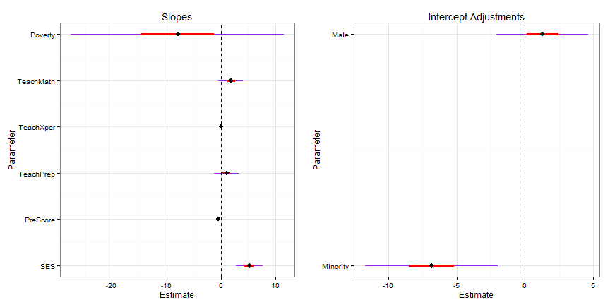
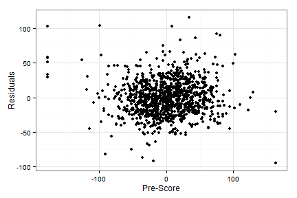
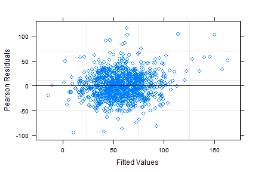
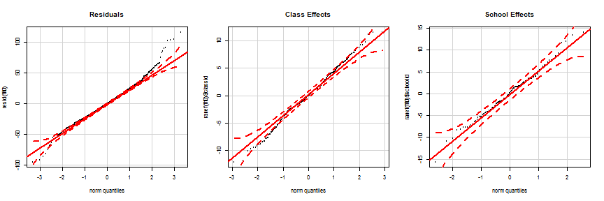
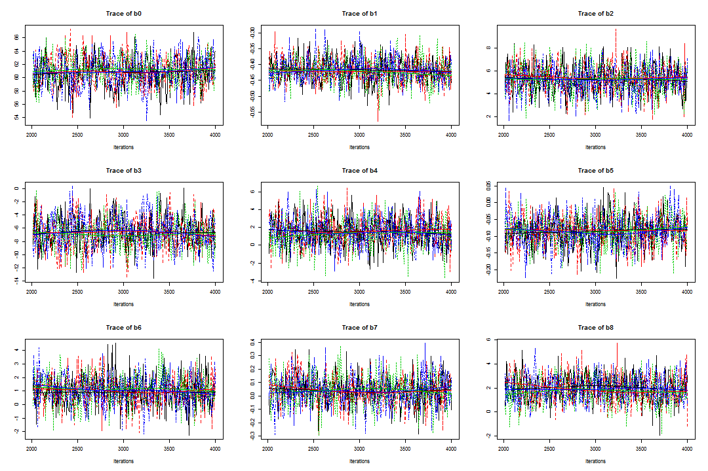
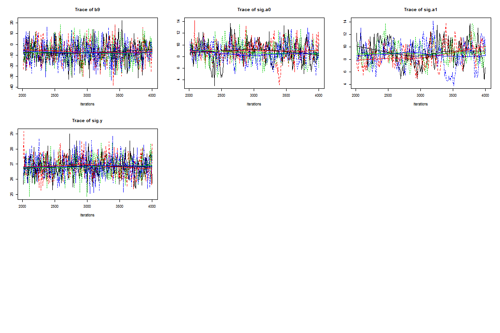
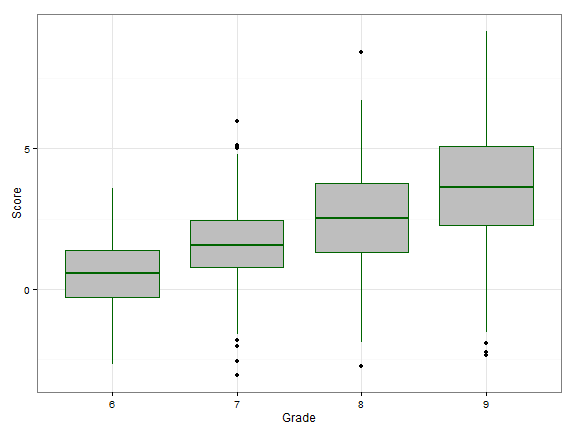
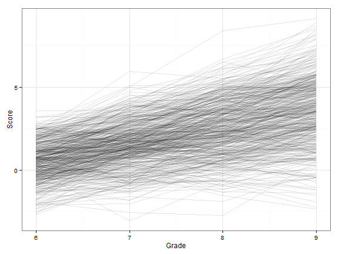
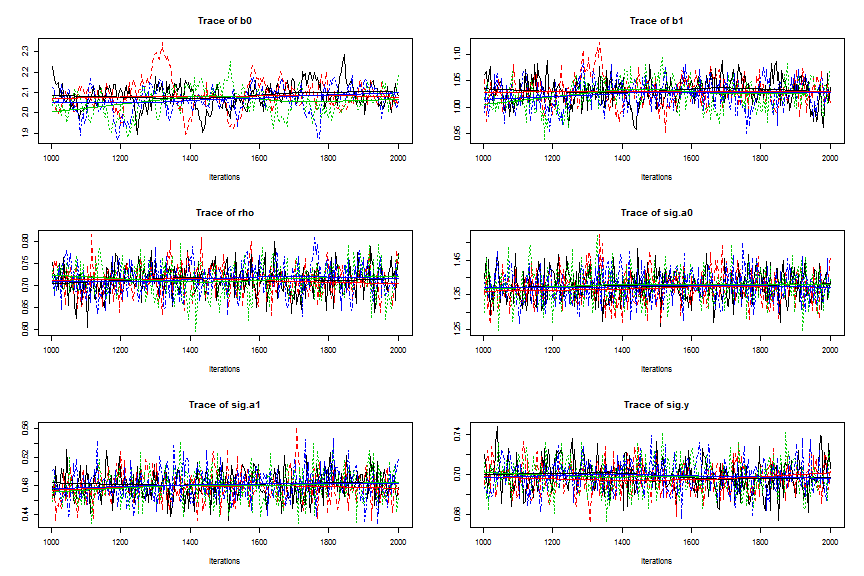
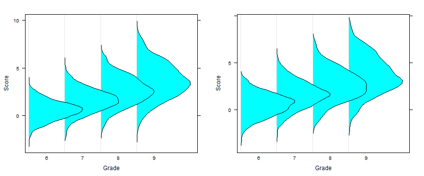

### Number 1 Part B

The first thing I did with these data was look at the missingness patterns because some of the scores of teacher's mathematics knowledge were missing.  On the left is the distribution of the increase in math score for both the missing and non-missing data.  The two distributions look to be fairly similar; the only noticeable difference is that all the students whose math scores decreased by 100 are from the missing data.  

For most of the explanatory variables, there was not much of a difference in the distribution between the missing and non-missing data.  However, on the right in the plot above it looks like the distribution of teacher's math preparation is plotted, and it looks like slightly more inexperienced teacher's are likely to have missing data.  The same pattern held for poverty rate --- poorer schools were slightly more likely to have missing data.  This means that we will need to be very careful about the inferences we make for these data because it is not safe to assume that the data are missing at random. Even though we have random selection, we probably shouldn't infer the results beyond these data nor should we make causal inferences.

Because we are mostly interested in exploring the relationships between the variables and not in finding a best fitting model, I decided to use Gelman's model selection strategy: keep all variables in the model unless they have a sign we don't expect and are not significant.  With that in mind, I should lay out the expected sign for each variable.  I wasn't sure what to expect for the sex variable so I'll include it in the model regardless.

|Variable         |Level       |Expected.Sign    |
|:----------------|:-----------|:----------------|
|sex              |individual  |no expectations  |
|minortiy         |individual  |negative         |
|SES              |individual  |positive         |
|mathPrescore     |individual  |positive         |
|teachrXper       |class       |positive         |
|teachrMath       |class       |positive         |
|teacherMathprep  |class       |positive         |
|povertyRate      |school      |negative         |

Next, I wanted to consider what interactions would be allowed in the model.  I decided to only consider interactions of categorical and quantitative variables at the individual level.  I thought quantitative by quantitative interactions would be unlikely and would be really hard to interpret so I ignored all those possibilities.  I also thought that interactions across different levels of the model would be unlikely so I ruled them out.

I then made plots like the one below to assess interactions.  To make this plot, 1000 bootstrap replicates of the data were made.  A loess smoother was then fit to each replicate.  Then, the density of the fitted values at 200 equal spaced intervals of the mathprescore variable was calculated.  The intensity of the color is proportional to the density.  So, in areas where the color is more intense, we are more certain of the location of the true mean math gain.

<iframe width = "723" height = "406" src = "vwSex_prescore.png"></iframe>

In this plot, it really appears that there is no difference in the relationship between men and women so I didn't include an interaction between pre-score and sex in the model.  There are a couple of notable features in the plot though.  It looks as though pre-score is truncated at 300 and 650.  The relationship looks to be fairly linear everywhere else, but, because of this truncation, things may not be entirely linear in the tails.  We'll have to check the residuals to make sure that the linearity assumption is reasonable.

The plot below looks for an interaction between pre-score and minority status.  Here, there does appear to be an interaction present.  It seems that the slope is slightly steeper for minorities than for non-minorities so I will include an interaction term for minority and pre-score in the model.

<iframe width = "723" height = "406" src = "vwMinority_prescore.png"></iframe>
Neither minority status nor sex seemed to have a strong interaction with SES when I made these plots, so I did not include those interactions.

I included random intercepts for both school and class-within-school only.  I considered random slopes, but they did not seem to provide any improvement to the model (measured using AICs) so I decided not to include any of them.  The final model I used is:

$Gain_i = \beta_0 + \beta_1 * SES_i + \beta_2 * pre_i + \beta_3 * I(minority_i == 1) + \beta_4 * I(sex_i == M) + \\ \beta_5 * I(minority_i == 1) * pre_i + \beta_6 * teacherPrep_{j[i]} + \\ \beta_7 * teacherExper_{j[i]} + \beta_8 * teacherMath_{j[i]} + \beta_9 * povertyRate_{k[i]} + \\ 
b_{1,j[i]} + b_{2,k[i]} +  \epsilon_i$

In this model $i$ denotes the student, $j[i]$ denotes the class for the $i^{th}$ student, and $k[i]$ denotes the school for the $i^{th}$ student.  $b_2$ is a random intercept for the $k^{th}$ school, $b_1$ is a random effect for the $j^{th}$ class in the $k^{th}$ school, and $\epsilon_i$ is a random error term for the $i^{th}$ student.  I centered all quantitative explanatory variables in this model.

Caterpillar plots for the fixed effects from the model are provided below.  These variables are all on different scales (in hindsight, I probably should have standardized everything) so I won't interpret the magnitude of the effect; instead, I'll just report on which variables have a positive or negative effect.  

It appears as though there is not much evidence to suggest that sex, teacher's experience, teacher's math knowledge, or school's poverty rate,  have a strong positive or negative effect on student's math improvement.  For each of these terms, there is just too much uncertainty to identify whether they have a strong effect on math improvement.  The 95% confidence interval for teacher's math knowledge contains zero, but most of the interval is above zero and the entire 50% interval is above zero.  So there is some evidence that teacher's math knowledge has a positive effect on student's improvement, but the evidence is not conclusive.

SES does tend to have a positive effect on student's math improvements.  Interestingly, the pre-score for both minorities and non-minorities has a negative relationship with math gain.  This could mean that student's who are already good don't tend to get much better.  Alternatively, it could mean that we are seeing a strong regression to the mean in these data.  This would suggest that students who did very well in kindergarten were just lucky and that luck dissipated the next year.

There is extremely strong evidence that the intercept adjustment for minorities is negative.  This suggests that, on average, minorities tend to have smaller improvements than non-minorities.  I did not include a caterpillar interval for the interaction term because it is fairly small.  But there is some evidence that the slope on pre-score is more negative for minorities; this would suggest that minority students who were initially strong did not improve as much as non-minorities who were initially strong.

The variances of both the class and school effect are both one-tenth the variance of the residual error.  This suggests that, relative to the noise is the data, the variability between schools and between classes within a school is not very large.

As we noted earlier, we should look at the pattern of the residuals vs pre-score to make sure that there are no violations of linearity.  The plot is located below, and there do not appear to be any patterns so this assumption is probably okay.

The residuals vs fitted values plot is located below.  There do not appear to be any noticeable patterns so the constant variance assumption is probably okay.

In the model, I assumed that all the random terms were normally distributed.  I can check these assumptions by making normal quantiles plots for each term.  These plots are located below.  There are a few outlying points in the tail of the residuals, but we have a large data set so this is not too uncommon.  Otherwise, these plots all look pretty good so the normality assumptions are probably okay.

To conclude, it looks as though the only strong predictors of math improvement are SES, pre-score, and minority status.  For the other variables, there is just too much uncertainty or the effect is too small to say that there is much of a relationship.  As noted before, we should be careful with our inferences for these data.  These results only hold for the 1081 students for whom we don't have missing data, and we can't say that any of the predictors cause the increase/decrease in the math improvement that we observed.

---
### Number 1 Part C

I fit the same model in JAGS using non-informative parameters.  I ran four chains, discarding the first 2000 iterations.  I then used a thinning interval of 8 for the next 2000 iterations.  This resulted in 1000 draws of the parameters.  Convergence diagnostics show that the posterior distributions have converged to stationary distributions.  Gelman's $\hat{R}$ was less than 1.02 for all the parameters and all the parameters had effective sample sizes of at least 150.  Trace plots of the parameters are provided below, and they show that the chains are mixing well.

A summary of the parameters is provided in the table below.  These are now credible intervals obtained from the posterior distribution of each parameter conditioned pn all the other parameters.  This means that they have a slightly different interpretation.  For example, if we wanted to interpret the coefficient on SES, we would say that there is a 95% chance that a 1 unit increase in SES is associated with between a 2.72 and 7.79 true mean gain in math score after accounting for all other variables in the model.

|id           |      2.5%|       25%|      50%|      75%|    97.5%|
|:------------|---------:|---------:|--------:|--------:|--------:|
|preScore     |   -0.4938|   -0.4456|  -0.4200|  -0.3934|  -0.3402|
|SES          |    2.7207|    4.4301|   5.2732|   6.1785|   7.7905|
|minority     |  -11.6205|   -8.2805|  -6.7592|  -5.0921|  -1.7422|
|male         |   -1.7564|    0.3108|   1.4140|   2.6498|   4.8224|
|Interaction  |   -0.1808|   -0.1177|  -0.0846|  -0.0532|   0.0077|
|TeachPrep    |   -1.2146|    0.2818|   1.0277|   1.7920|   3.2877|
|TeachXper    |   -0.1853|   -0.0330|   0.0381|   0.1150|   0.2736|
|TeachMath    |   -0.1298|    1.0597|   1.8720|   2.7351|   4.0489|
|Poverty      |  -26.1502|  -13.7983|  -7.5987|  -0.8332|  11.8967|
|School SD    |    5.3766|    7.7167|   8.8391|   9.8604|  12.1103|
|Class SD     |    5.3254|    7.6723|   8.9047|  10.0291|  12.1741|
|Residual SD  |   25.5208|   26.3837|  26.8501|  27.3176|  28.1900|

---
### Number 2

For this problem, we are given information on the math scores of 500 students in grades 6 through 9.  The distribution of score in each grade is plotted below.  It looks as though there is a linear relationship between score and grade so I treated grade as a quantitative variable.

The trajectory of each child over time is plotted below.  There appears to be a lot of variability in the intercepts of each child.  Though there is not as much variability in the slopes, it still looks like it might be worth allowing the slopes to vary by student.

The model used was $y_i = \beta_0 + \beta_1 * grade_i + \beta_{2,j[i]} + \beta_{3,j[i]} * grade_i + \epsilon_i$.  Here, $y_i$ is the math score for the $i^{th}$ observation.  $\beta_{2,j[i]}$ and $\beta_{3,j[i]}$ follow a multivariate normal distribution with a mean vector of 0 and a 2x2 variance-covariance matrix.  This matrix has $\sigma_{\beta2}^2$ and $\sigma_{\beta3}^2$ on the diagonal and $\sigma_{\beta2} * \sigma_{\beta3} * \rho$ on the off-diagonal.  The errors are assumed to be independent of the random effects and to be $\sim N(0, \sigma_y^2)$.

I put diffuse normal priors on the fixed effects in the model.  I used a scaled-inverse Wishart distribution with 3 df as the prior on the random slope, random intercept, and the correlation between the two.  I used a diffuse uniform prior on the residual variability in the data ($\sigma_y^2$).  I centered the explanatory variable (grade) when passing it into JAGS.

4 chains were used for the MCMC sampling, and the first 1000 iterations were discarded as a warm-up.  A thinning interval of 4 was used for the next 1000 observations.  The diagnostics for the model look pretty good.  Gelman's $\hat{R}$ are less than 1.02 for all the terms and the multivariate $\hat{R}$ is 1.02.  Traceplots for each term are provided below and show that the chains appear to be mixing well.  Overall, it looks like things have converged.

Summaries of the conditional posterior distributions for each of the terms in the model are provided below.  It does appear that math scores do tend to increase over time.  Based on this model and data, there is a 95% chance that moving from one grade to the next is associated with between a 0.97 and 1.07 increase in the true mean math score.  

|id            |   2.5%|    25%|    50%|    75%|  97.5%|
|:-------------|------:|------:|------:|------:|------:|
|Intercept     |  1.932|  2.032|  2.075|  2.115|  2.199|
|Slope         |  0.975|  1.009|  1.029|  1.046|  1.078|
|Correlation   |  0.646|  0.689|  0.714|  0.736|  0.777|
|Intercept SD  |  1.290|  1.342|  1.374|  1.406|  1.467|
|Slope SD      |  0.440|  0.467|  0.481|  0.495|  0.523|
|Residual SD   |  0.668|  0.687|  0.698|  0.709|  0.730|

It is easier to plot these results.  Below is a plot of the posterior distribution of the true mean math score for each grade on the left and the posterior distribution for a new student on the right.  We can see that there is slightly more variability in the scores for a new student, as we'd expect.  There is not much more though.  This suggests that there is not much residual variability - most of the uncertainty in these data concerns the location of the mean score for each grade.

There is also more uncertainty as students get older.  I theorize that this is because there's just not that much of a difference between good students and weaker students at the younger ages.  As the students age, the good students advance into geometry and trig while the weaker students fall behind a little bit.  The increased variability for older students originates because we start to see students differentiate themselves by ability.

Since these students are randomly selected, we can say that these improvements that we've found in math scores will hold true for all students.  We can't make causal inferences, but we can say that as students increase in age by one year, their true mean math achievement score tends to increase by 1 (with a 95% credible interval from 0.975 to 1.078) 

---
### R Code

